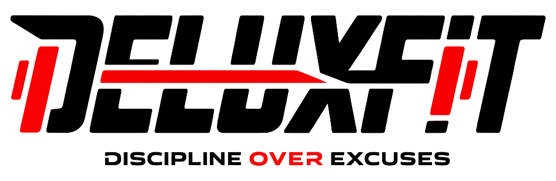
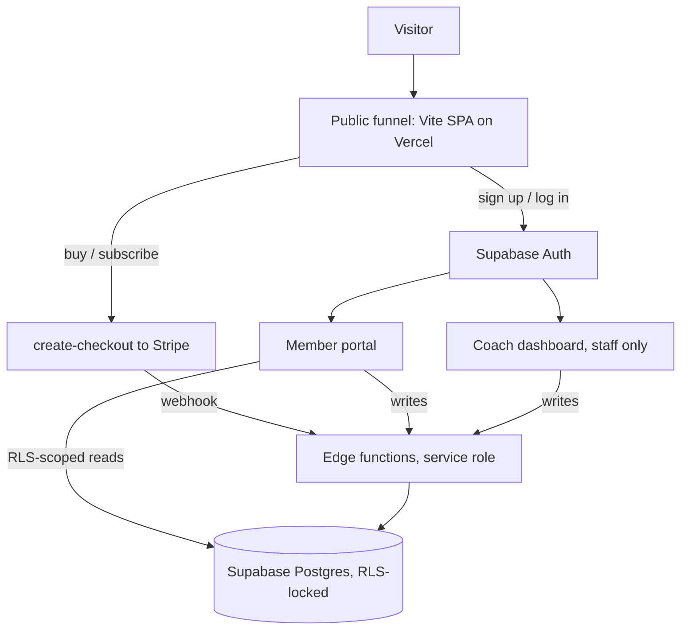

<p align="center">
  <picture>
    <source media="(prefers-color-scheme: dark)" srcset="docs/logo-dark.png" />
    
  </picture>
</p>

<h1 align="center">DeluxFit by Angie</h1>

<p align="center">
  <b>Discipline over excuses.</b>
</p>
<p align="center">
  The direct-sale funnel, member portal, and coach dashboard for certified personal trainer Angie —<br />
  memberships, online coaching, and live 1-on-1 training.
</p>

<p align="center">
  
  
  
  
  
  
  
</p>

<br />

## Why DeluxFit

Most trainer sites sell a service and then hand the client off to a spreadsheet and a text thread. This one keeps the whole relationship in the same app: the public funnel closes the sale through Stripe, the buyer signs in to a portal with their plan, nutrition, progress, bookings, and a message thread, and the coach works the other side of that same data from a staff-gated dashboard. The browser never holds a privileged key — every sensitive write goes through an edge function.

<table width="100%">
  <tr>
    <td width="50%" valign="top">
      <h3 align="center">Server-owned writes</h3>
      <p align="center">The client only performs RLS-scoped reads. Checkout, bookings, messaging, progress, and content authoring all run through Deno edge functions holding the service-role key.</p>
    </td>
    <td width="50%" valign="top">
      <h3 align="center">Bilingual by construction</h3>
      <p align="center">Every string on the public funnel comes from parallel English and Spanish content trees, so the whole site switches language without a second set of components.</p>
    </td>
  </tr>
</table>

<br />

## Stack

| Layer | Technology |
| :--- | :--- |
| UI | React 19 + a hand-rolled SPA router (no `react-router`) |
| Build & dev | Vite 7 |
| Styling | Tailwind CSS 3 + the in-repo design system (`@deluxfit/ds`, `--df-*` tokens) |
| Components & motion | Radix UI, `class-variance-authority`, `clsx`, `tailwind-merge`, `tailwindcss-animate`, Framer Motion 12, `lucide-react` |
| Backend | Supabase — Auth, Postgres + RLS, 15 Deno edge functions |
| Payments | Stripe Checkout, driven entirely from the edge functions |
| i18n | Custom English / Spanish content trees |
| Analytics | First-party, cookieless Sunday Analyzer beacon |
| Hosting | Vercel (SPA rewrites + security headers) |

## Getting started

Requires Node `22.x`.

```bash
npm install
npm run dev           # Vite dev server
npm run build         # production build to dist/
```

No environment configuration is required — the Supabase URL and publishable key are baked into `src/config/supabase.js`, so the app runs as-is.

| Variable | Purpose |
| :--- | :--- |
| `VITE_SUPABASE_URL` | Optional override for the Supabase project URL. |
| `VITE_SUPABASE_ANON_KEY` | Optional override for the browser publishable key. |

Stripe secrets, the service-role key, and price ids live in the Supabase project, never in this repo. When Stripe is not configured, `create-checkout` returns `{ configured: false }` and the UI says so instead of faking a charge.

### Scripts

| Script | Does |
| :--- | :--- |
| `npm run dev` | Start the Vite dev server. |
| `npm run build` | Production build to `dist/`. |
| `npm run preview` | Serve the production build locally. |
| `npm run lint` | Lint with ESLint. |
| `npm run lint:fix` | Lint and auto-fix. |
| `npm run format` | Format `src/**` and `packages/**` with Prettier. |
| `npm run format:check` | Check formatting without writing. |

## Architecture



## How it works

- **Three surfaces, one bundle.** Vercel rewrites every path to `index.html` and the router picks the page. `/portal` and `/admin` mount their own root-level shells; `/admin` additionally requires `profiles.role = 'staff'`.
- **The funnel sells four offers.** Membership at $14.99/month, personalized online coaching at $150/month, a $75 single live session, and a $50/session live training program — each CTA opens a Stripe Checkout session through `create-checkout`.
- **The portal is the product after the sale.** Overview, workout plan, nutrition targets, progress history, bookings, a coach message thread with private attachments, and a media library — all RLS-scoped to the signed-in member.
- **The dashboard is the same data from the coach's side.** Staff author plans, nutrition, and library content, review progress, and manage bookings, memberships, and invites; every admin function re-checks staff status server-side.
- **The design system is consumed from source.** `packages/deluxfit-design-system` is aliased as `@deluxfit/ds` with no build step; `--df-*` CSS variables are mirrored into Tailwind by `tailwind-preset.cjs`, and `data-theme` re-scopes them on any subtree.
- **Migrations are append-only.** `migrations/` holds ordered SQL DDL for the schema, RLS policies, and storage buckets, plus a transaction-wrapped `verify_rls_isolation.sql` self-test.

## Project structure

```
deluxfitbyangie-com/
├── public/
│   ├── brand/                     Studio + gym brand photography
│   └── deluxfit-logo.png          Wordmark used across the app
├── docs/logo-dark.png             Dark-scheme wordmark
├── migrations/                    Ordered SQL DDL, RLS policies, RLS self-test
├── supabase/functions/            15 Deno edge functions (service role)
├── packages/
│   └── deluxfit-design-system/    In-repo DS — --df-* tokens, Tailwind preset, components
├── src/
│   ├── router/                    Hand-rolled SPA router (path match + <Link>)
│   ├── pages/                     Public funnel — Home, Membership, Online Coaching, …
│   ├── components/                Site chrome, forms, photo layouts
│   ├── auth/                      Supabase Auth provider, protected routes, roles
│   ├── portal/                    Signed-in member portal and its panels
│   ├── admin/                     Staff-gated coach dashboard
│   ├── lib/                       payments, booking, portal/admin APIs, analytics beacon
│   ├── i18n/                      English + Spanish content trees
│   └── config/supabase.js         Browser Supabase client
├── vite.config.js                 `@` and `@deluxfit/ds` aliases, chunking
└── vercel.json                    SPA rewrites + security headers
```

## License

Private and proprietary — all rights reserved.

<br />

<p align="center">
  <sub>Built by <a href="https://taylorurl.com">TaylorURL</a> — custom sites for local businesses.</sub>
</p>
