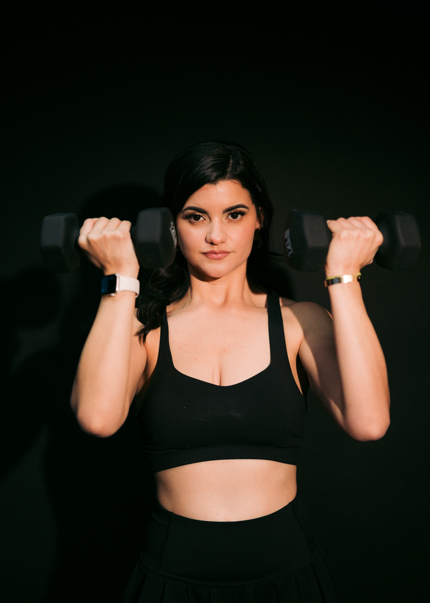
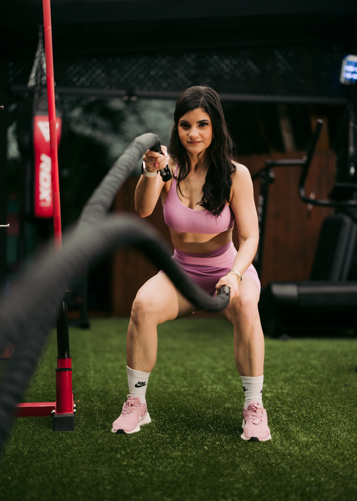
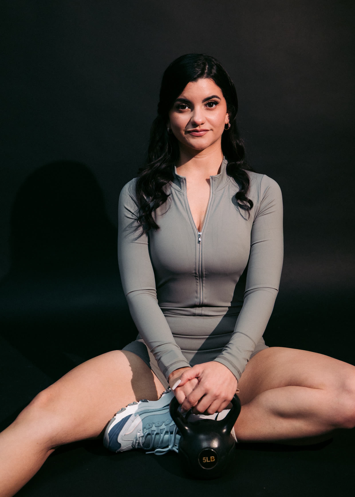
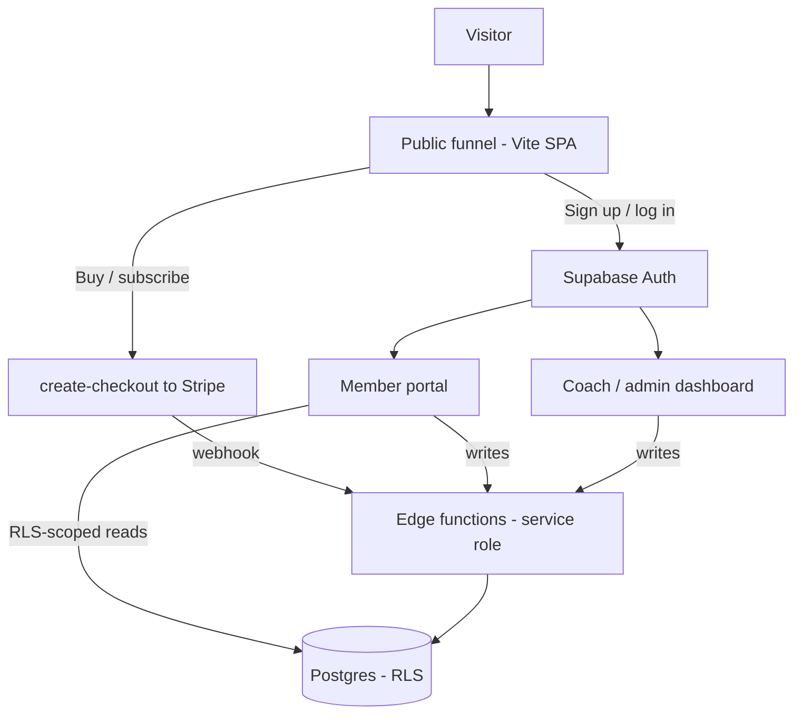

<p align="center">
  <picture>
    <source media="(prefers-color-scheme: dark)" srcset="docs/logo-dark.png">
    
  </picture>
</p>

<h1 align="center">DeluxFit by Angie</h1>

<p align="center"><b>Direct-sale funnel, member portal, and coach dashboard for certified personal trainer Angie.</b></p>
<p align="center">
  Discipline over excuses — memberships, online coaching, and live 1-on-1 training.<br />
  <a href="https://deluxfitbyangie-com.vercel.app">deluxfitbyangie-com.vercel.app</a>
</p>

<p align="center">
  
  
  
  
  
  
</p>

<br />

<p align="center">
  
  
  
</p>

- **Full-funnel personal training** — a bilingual (EN/ES) React landing site that sells the membership, online coaching, single sessions, and a live program, then checks buyers out through Stripe.
- **Members and coaches, one codebase** — a signed-in member portal (plans, nutrition, progress, bookings, messaging) and a staff-gated coach dashboard, both backed by Supabase Auth and row-level security.
- **Server-owned writes** — the browser only ever reads RLS-scoped rows; every sensitive write (bookings, messages, checkout, content) runs through Deno edge functions that hold the service-role key.

## Stack

| Layer      | Tech |
| ---------- | ---- |
| Framework  | React 19 + Vite 7, a hand-rolled SPA router (no `react-router`) |
| Styling    | Tailwind CSS 3 + the in-repo design system (`@deluxfit/ds`, `--df-*` tokens) |
| UI + motion | Radix UI, class-variance-authority, clsx, tailwind-merge, tailwindcss-animate, Framer Motion, lucide-react |
| Backend    | Supabase — Auth, Postgres + RLS, and 15 Deno edge functions |
| Payments   | Stripe, driven entirely server-side from the edge functions |
| i18n       | Custom English / Spanish content trees |
| Hosting    | Vercel (SPA rewrites + security headers in `vercel.json`) |

## Getting started

Requires Node `22.x`. The Supabase URL and anon key are baked into `src/config/supabase.js`
(overridable with `VITE_SUPABASE_URL` / `VITE_SUPABASE_ANON_KEY`), so the app runs with no
env setup.

```bash
npm install
npm run dev
```

| Script | Does |
| ------ | ---- |
| `npm run dev` | Start the Vite dev server |
| `npm run build` | Production build to `dist/` |
| `npm run preview` | Serve the production build locally |
| `npm run lint` / `lint:fix` | ESLint, with optional autofix |
| `npm run format` / `format:check` | Prettier over `src/` and `packages/` |

## Architecture

The client is a single Vite bundle; Vercel rewrites every path to `index.html` and the
router picks the page. The public funnel, the member portal, and the coach dashboard are all
served from the same SPA and gated by Supabase Auth (the dashboard additionally requires
`profiles.role = 'staff'`). Reads are RLS-scoped selects straight from the browser; all
privileged writes and Stripe calls go through edge functions that own the service-role key.



### The three surfaces

- **Public funnel** (`src/pages`) — Home, About, Membership, Online Coaching, Single Session, Live Training (`/training`), Testimonials, and Contact. Presents the four offers ($14.99/mo membership, $150/mo coaching, $75 single session, $50/session live program) and routes purchase CTAs into Stripe Checkout via the `create-checkout` function.
- **Member portal** (`src/portal`, `/portal`) — overview, workout plan, nutrition, progress, bookings, message thread with the coach, and a media library, populated from RLS-scoped reads.
- **Coach dashboard** (`src/admin`, `/admin`) — staff-only tools to author plans, nutrition, and content, review progress, manage bookings, memberships, and clients, and message members.

### Supabase backend

- **`supabase/functions/`** — 15 Deno `Deno.serve` edge functions (checkout, Stripe webhook, bookings, messaging, progress logging, signed media URLs, user invites, and coach/admin upserts). Coach/admin functions enforce `requireStaff` server-side. See the folder's own README for the full table and deploy steps.
- **`migrations/`** — ordered, append-only SQL DDL for the schema, RLS policies, storage buckets, and a transaction-wrapped `verify_rls_isolation.sql` self-test.

### Design system

`packages/deluxfit-design-system` is the in-repo "gym-luxe" design system, consumed via the
`@deluxfit/ds` alias with no separate build step. Tokens live under the `--df-*` CSS-variable
namespace and are mirrored into Tailwind by `tailwind-preset.cjs`; it ships the buttons,
cards, pricing cards, inputs, and section/layout primitives the whole site is built from.

## Project structure

```
deluxfitbyangie-com/
├── public/
│   ├── brand/                    # studio + gym brand photography
│   └── deluxfit-logo.png         # wordmark used across the app
├── src/
│   ├── router/                   # hand-rolled SPA router (path match + <Link>)
│   ├── pages/                    # public funnel pages
│   ├── components/               # site chrome, forms, photo layouts
│   ├── auth/                     # Supabase Auth provider + protected routes
│   ├── portal/                   # signed-in member portal
│   ├── admin/                    # staff-gated coach dashboard
│   ├── lib/                      # payments, booking, form + portal/admin APIs
│   ├── i18n/                     # English + Spanish content trees
│   └── config/supabase.js        # browser Supabase client
├── packages/deluxfit-design-system/  # in-repo DS (@deluxfit/ds), --df-* tokens
├── supabase/functions/           # 15 Deno edge functions (service role)
├── migrations/                   # ordered SQL DDL + RLS + verify script
├── vite.config.js                # @ and @deluxfit/ds aliases
└── vercel.json                   # SPA rewrites + security headers
```

## License

Private and proprietary — all rights reserved. Built by [TaylorURL](https://www.taylorurl.com).
